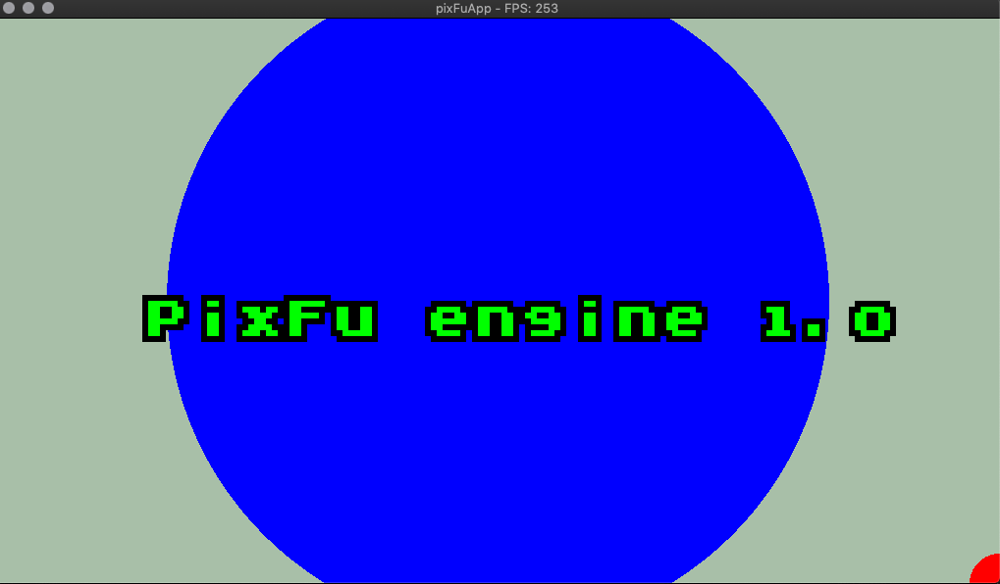
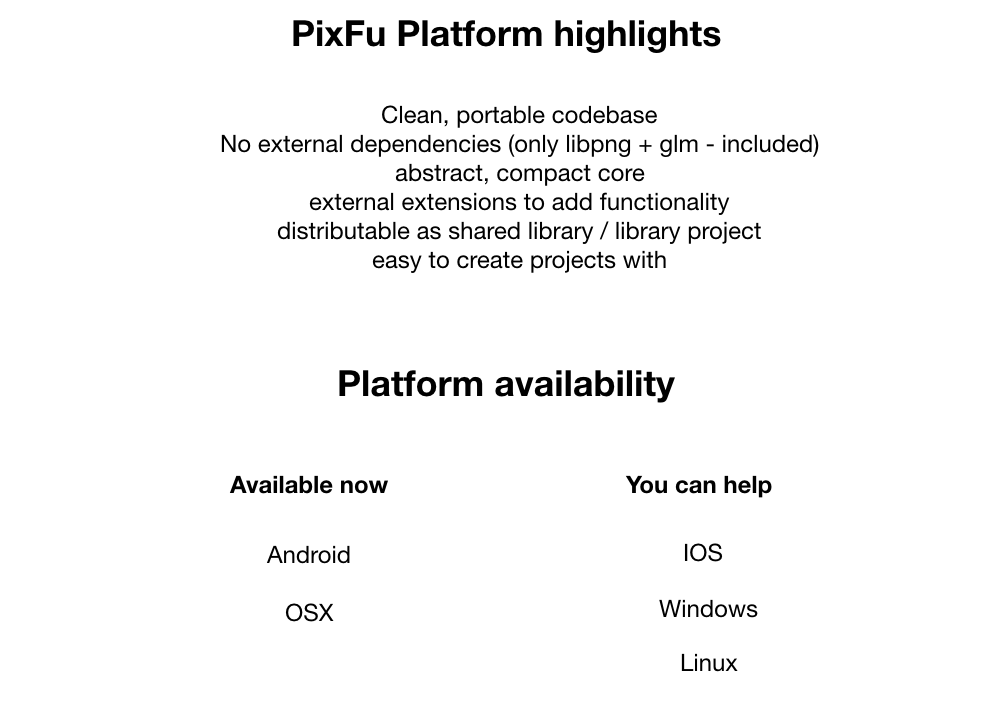
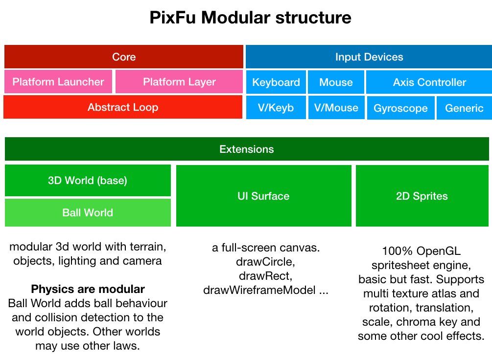
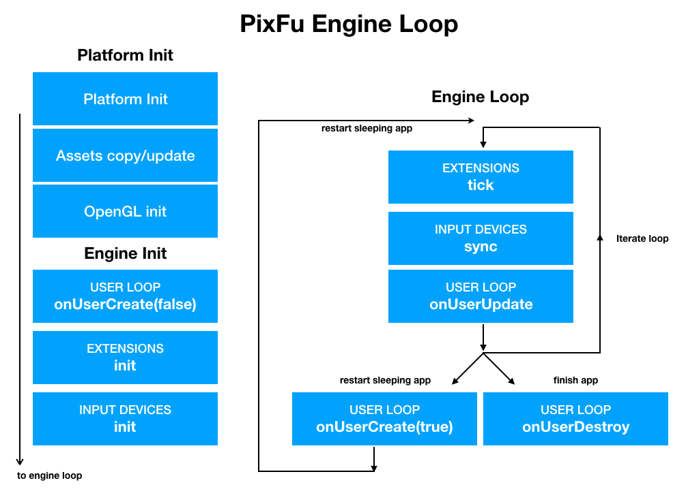
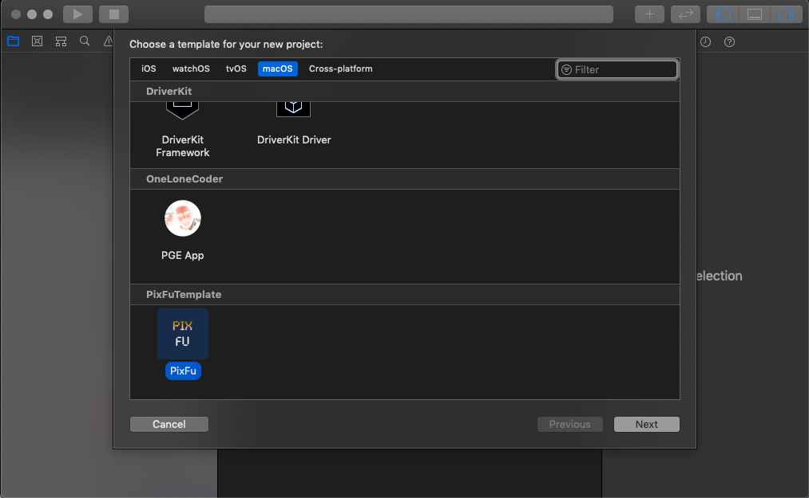
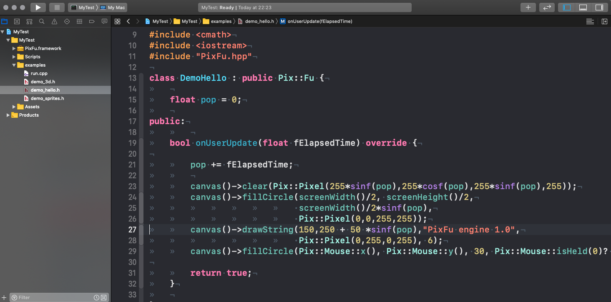
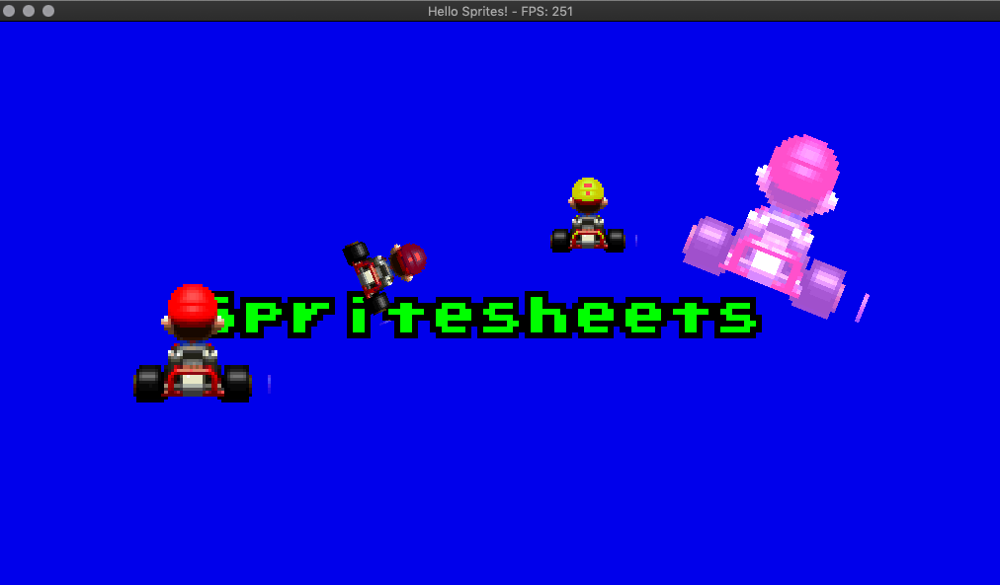
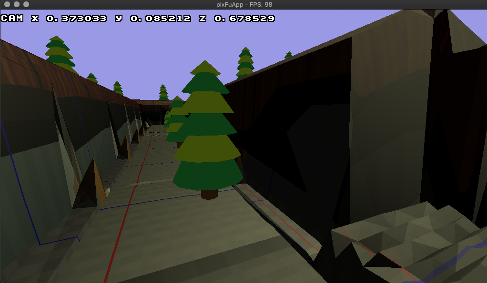
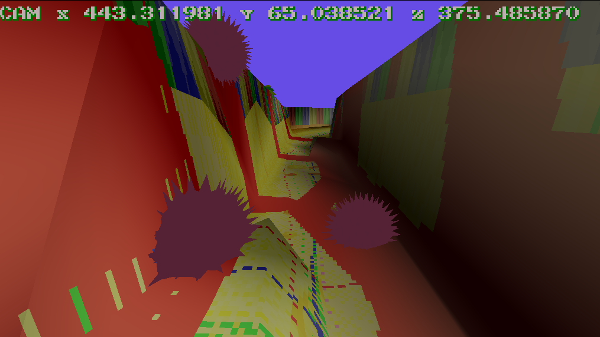

What is PixFu
=============

PixFu is a minimalistic modular game / realtime system engine. It is 100% written in C++ and OpenGL and runs on Desktop computers and Mobile devices (Android at the moment, IOS coming next).

PixFu core is based on famous engine OneLoneCoder Pixel Game Engine (http://onelonecoder.com) and has a redesigned full modular approach to allow optimizations for mobile devices and embedded platforms.

 Key Features:

- PixFu core is highly optimized and abstract, it doesn't really do anything besides abstracting all platform details, initialize input devices and run a loop. 
    
    
- Everything is based on extensions that you instantiate. Extensions are also easy to write. 
    
- PixFu is an excellent starting point for a pure C++ mobile application!
    

 Provided Extensions:
 
-  UI Surface: provides a 2D canvas with functions to draw circles, lines, rectangles and multi-font strings. This extension is enabled by default. Source code for this extension comes from OLC PGE core. 
    
- Sprites: OpenGL powered spritesheets supporting  scaling, rotation and chroma key effects. Multiple spritesheets can be active.

- World: Modular 3D world with terrain texture, height map, lighting, camera and logic to insert and manage 3D objects. Reads WaveFront OBJ models and their textures.
    

Other Features:

- OLC Pixel Game Engine compatibility layer, provides a base class that mimics the PGE Engine class. You can easily port your PGE modules to PixFu! (Note- Extensions are not supported, and not all functionality is emulated)

- Includes GLM library, used internally, but also exported so it is ready to use in your project. The library is compiled with FORCE_LEFT_HANDED flag, so angles are positive clockwise and physics behave as expected.
    
- 100% modular structure allows to enable just the features you need. Even the primary UI surface is an extension that maybe you don't need in your project!

PixFu Workflow
=============

PixFu provides a base Engine class that you will extend to your convenience. The base class abstracts all platfom details, and automatically manages extensions and input devices. 
Your code will be very tight without any extraneous background libraries or services !

How To Start
=============

This is a XCode template that will allow you to quickly create new projects from the XCode wizard.

Pre-requisites
--------------

- XCode, recent version (osx 10.14). lower may work.

Getting Started
---------------
1. Get the binary release of this project
 https://github.com/nebular/PixFu_macOS/releases
 
2. Unpack the file and execute the install script with su. Alternatively,
 just copy the template to the XCode templates folder (that is just what the script does)
`
3. Open Xcode and press New Project, scroll to the bottom and you should see PixFu.

4. You will get a new PixFu blank project with 3 demos. The PixFu engine is included as a Framework that contains all binary and headers.

5. Just press PLAY and the first demo should run. You can launch the other two demos by editing the file run.cpp

Examples
--------------------------------------

- demo_hello.h: Just 4 lines of a hello world.

 
- demo_sprites.h: A demo using the Sprites extension.

  

    
- demo_3d.h: A demo using the 3D world extension. A barebones world with a camera that you can move.

  

    
- demo_3d_balls.h: A demo using advanced features of the 3D world extension. Add viruses to the world with the space key ! 

  

Support
-------
If you've found an error please [file an issue] (https://github.com/nebular/PixFu_Android/issues/new).

Patches are encouraged, and may be submitted by [forking this project](https://github.com/nebular/PixFu_Android/fork) and submitting a pull request through GitHub.

License
-------

https://creativecommons.org/licenses/by/4.0/
